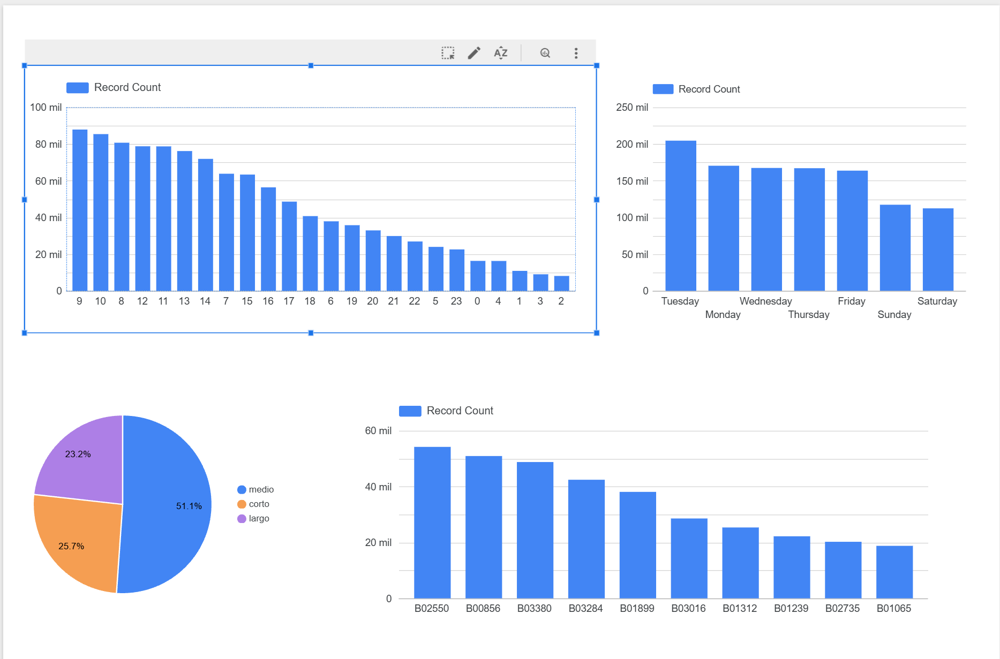

# NYC Taxi Pipeline

End-to-end data engineering pipeline built with Python, SQL, and Google Cloud Platform using NYC For-Hire Vehicle (FHV) trip data from January 2023.

## Architecture

```
Local (.parquet) → Google Cloud Storage → BigQuery → Looker Studio
                         ↑
                    Prefect Pipeline
```

## Tech Stack
- Python (pandas)
- Google Cloud Storage (GCS)
- BigQuery
- Prefect
- Looker Studio
- GitHub

## Business Questions
1. Which hours of the day have the most trips?
2. Which destination zones are most popular?
3. Which company dispatches the most trips?
4. On which days of the week are trips longest?

## Phase 1: Data Exploration
- Loaded FHV dataset (1,114,320 trips) using pandas
- Defined 4 business questions to answer throughout the project
- Identified data quality issues

## Phase 2: Data Ingestion
- Uploaded raw `.parquet` file to Google Cloud Storage
- Created `viajes_fhv` table in BigQuery
- Loaded 1,114,320 records from GCS to BigQuery

### Data Quality Findings
- Original dataset contains 1,114,320 trips
- 11,729 trips had a duration of less than 1 minute or more than 300 minutes
- Clean data represents 98.95% of the original dataset

## Phase 3: Data Transformation
- Created `viajes_fhv_limpio` table excluding invalid trip durations
- Added `hora`, `dia_semana`, and `categoria_viaje` columns
- Answered 4 business questions directly in BigQuery using SQL

## Phase 4: Orchestration
- Built `pipeline.py` using Prefect to automate the full ETL flow
- Pipeline consists of 3 tasks: upload to GCS, load to BigQuery, transform data
- Each task is logged and tracked with execution status and timing

## Dashboard

